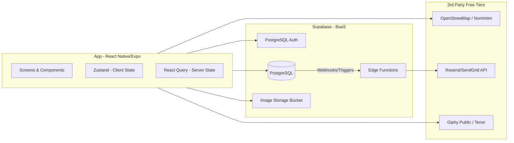

# MyMatch Phase 2: Scope Finalization (MVP)

Based on our clarifications in Phase 1, here is the finalized scope for the MyMatch MVP. 

## User Review Required

> [!IMPORTANT]
> Please review the Final Feature List, Architecture, Tech Stack, and Data Models. If everything aligns with your vision, you can approve this plan so we can move to **Phase 3 (Development Plan)**.

---

## 1. Final Feature List (Grouped by Modules)

### Authentication & Profile Module
- Email OTP Authentication (Supabase Auth).
- Unified Profile Creation with single or dual intent (Dating, Platonic, or Both).
- Photo uploads (Photos go live immediately without proactive manual review).
- User location defaults to general/coarse location (e.g., City). Precise location is stored only if the user actively opts in during profile creation or meetup planning.

### Discovery & Swiping Module
- Feed generated based on user intent and general location.
- Standard Swipe UI: Right swipe (Like), Left swipe (Pass).
- Ability to send a personalized "Compliment" before matching.
- Mutual likes instantly create a Match.

### Match & Messaging Module
- Real-time chat (Supabase Realtime) for mutual matches.
- Image sending and GIF searching (Tenor API).
- *Scalability note: We will not eagerly delete old chat messages yet, but we will add a storage alert watcher for the free-tier database limits.*

### Meetup & Security Module (Core Differentiator)
- **Smart Date Spots:** Uses precise location (if opted-in) or general location to compute a midpoint. Suggests venues via Google Places API.
- **Trusted Contact Date Sharing:**
  - Instead of sharing live location automatically, the user explicitly exports the match's profile details.
  - The user manually inputs the Match's contact details and the Trusted Contact's email.
  - The user provides their own live location link (e.g., Apple Maps / WhatsApp share connection or similar static tracker URL).
  - An email is dispatched with these details to the Trusted Contact.
- **Cancellation Alerts:** If unmatching occurs before the date, a "Date Cancelled" email alert is sent to the Trusted Contact.
- **Throttling:** If we build an in-app live location tracking mechanism, it will be strictly throttled (1-2 mins per ping) instead of high-frequency WebSocket updates to respect Supabase free-tier limits.

### Group Events Module
- **Admin Hosted Events:** MyMatch verified, responsible for safety/security.
- **User Hosted Events:** Promoted via the app as a third-party event. MyMatch claims zero liability.
- Browse, RSVP, and capacity limits.

---

## 2. User Flows (Step-by-Step)

**Onboarding & Profile Setup:**
1. Splash Screen → Email OTP → Verify.
2. Select Intent ('Dating', 'Platonic', or 'Both').
3. Upload Photos & Fill Bio.
4. Set Location (General vs Precise Opt-in).

**Match to Chat to Meetup:**
1. Main Feed → User A likes User B.
2. User B swiping → Sees User A → Likes User A → Match created.
3. Open Chat → Users talk.
4. Click "Plan Meetup" → System calculates Midpoint → Google Places returns Venues → Venue Selected.

**Date Sharing Flow (Safety):**
1. Venue agreed upon → User clicks "Share Date Details".
2. System pulls Match's Profile info.
3. User manually inputs the Match's newly acquired contact info.
4. User pastes their own Live Location tracking link and inputs Trusted Contact Email.
5. System triggers Supabase edge function to send Email to the Trusted Contact.
6. *Edge case: If User cancels or unmatches later, system sends a follow-up "Date Cancelled" email.*

---

## 3. System Architecture (High-Level)

---

## 4. Tech Stack

- **Frontend:** React Native (Expo SDK 52+), TypeScript, React Navigation (or expo-router), Zustand (Local State), TanStack React Query (Server caching).
- **Backend & DB:** Supabase (Postgres, Row Level Security, Storage, Edge Functions). Free tier defaults.
- **APIs:** Google Places API (Midpoints), Resend or SendGrid (Transactional Emails), Tenor API (GIFs).
- **UI Styling:** NativeWind (Tailwind for React Native) or Tamagui for fast development, with curated colors for a premium dating app feel.
- *Note: No paid subscriptions (e.g., RevenueCat) in MVP. Planned for version 2.0.*

---

## 5. APIs Required

1. **Authentication API:** `supabase.auth.signInWithOtp()`
2. **PostgREST (CRUD):** 
   - `profiles`, `swipes`, `matches`, `messages`, `events`.
3. **RPC Queries:** 
   - `get_discovery_feed(intent, location, limit)` for advanced feed matching.
   - `create_match_if_mutual(target_id)` transactional match check.
4. **Google Places API:** 
   - `/maps/api/place/nearbysearch` for midpoint smart venues.
5. **Edge Functions / Hooks:** 
   - `POST /send-trusted-email` (Triggered via UI when submitting date details).
   - `POST /notify-date-cancel` (Triggered via DB webhook on unmatch).

---

## 6. Data Models (Key Entities)

- **`users`** (Supabase Auth built-in): `id`, `email`, `created_at`.
- **`profiles`:** `id`, `user_id`, `name`, `bio`, `intent` ('dating', 'platonic', 'both'), `general_location`, `is_precise_location_opted_in`, `photos[]`.
- **`swipes`:** `swiper_id`, `target_id`, `direction` ('like', 'pass').
- **`matches`:** `id`, `user_a_id`, `user_b_id`, `created_at`.
- **`messages`:** `id`, `match_id`, `sender_id`, `body`, `image_url`, `created_at`.
- **`events`:** `id`, `host_type` ('admin', 'user'), `title`, `description`, `location`, `capacity`, `joined_count`.
- **`date_shares`:** `id`, `match_id`, `trusted_email`, `match_contact_info`, `live_location_link`, `status` ('active', 'cancelled'), `created_at`.

---

## Open Questions

> No open questions remain from Phase 1. 

## Verification Plan

### Automated / API Verification
- Successful build of Expo app skeleton.
- Verified connection to Supabase free tier dashboard.
- Verified test email delivered via Resend/SendGrid sandbox.

### Manual Verification
- Reviewing UI components for premium aesthetic standards.
- Ensuring the app workflow maps exactly to the defined user flows above.
