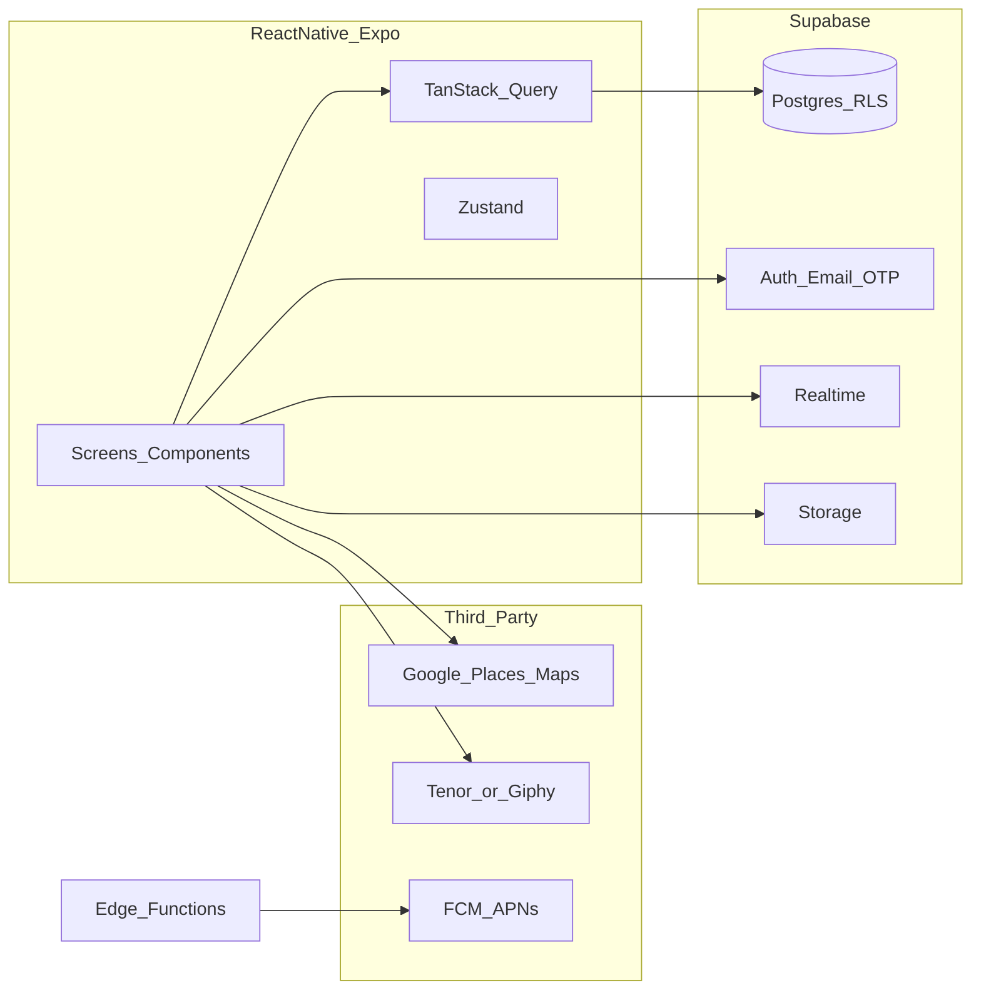

# My Match — Production Technical Plan

This document is structured for direct use in Cursor (or similar) as the source of truth for implementation. **Assumptions** are called out explicitly where the business plan leaves room for choice.

---

## 1. Project Overview

**Summary:** My Match is a mobile social/dating application that emphasizes **safe real-world interaction**: smart public meetup suggestions (midpoint-based), **trusted-contact date sharing** with optional live location, **group hangout events** to reduce 1-on-1 pressure, and support for **both dating and platonic** networking. It addresses the gap between “match” and “meetup” through safety, comfort, and structured offline engagement.

**Key objectives (technical):**

- High-trust auth and profile verification flows.
- Low-latency discovery, swipe, and match pipelines.
- Real-time messaging with media and read receipts.
- Location-aware features with **privacy-first** defaults (approximate distance, explicit consent for precise sharing).
- Scalable event system for group meetups with capacity limits.
- Observable KPIs: match→meetup signals, event participation, safety-feature usage, retention.

---

## 2. Technical Architecture


| Layer             | Recommendation                                                                                                           | Rationale                                                                                                                                                                                                                       |
| ----------------- | ------------------------------------------------------------------------------------------------------------------------ | ------------------------------------------------------------------------------------------------------------------------------------------------------------------------------------------------------------------------------- |
| **Mobile app**    | **Expo (SDK 52+) + TypeScript**                                                                                          | Fast iteration, OTA updates (EAS Update), simplified native modules (maps, push, image picker), strong Cursor/solo-dev ergonomics. Use **development builds** when you need custom native code beyond Expo Go.                  |
| **Navigation**    | **React Navigation 6** (native stack + bottom tabs + nested stacks for modals)                                           | Industry standard; deep linking and auth gates map cleanly.                                                                                                                                                                     |
| **Backend**       | **Supabase** (Postgres, Auth, Row Level Security, Realtime, Storage) **or** **Firebase** (Auth, Firestore, Storage, FCM) | Both suit small teams. **Default recommendation: Supabase** for relational data (matches, events, RSVPs, messages metadata), SQL, and clear RLS. Alternative: Firebase if you prefer document model and heavy Google ecosystem. |
| **API style**     | **REST + Realtime**                                                                                                      | Use Supabase **PostgREST** for CRUD + **Realtime** for chat/presence; avoid GraphQL unless you have complex cross-entity reads that justify Apollo overhead.                                                                    |
| **Maps / places** | **Google Maps Platform** (Places API, Geocoding, optionally Directions) or **Mapbox**                                    | Midpoint geocoding + nearby venue search require a places provider; budget for API quotas.                                                                                                                                      |
| **Push**          | **Expo Notifications** + FCM/APNs (via EAS)                                                                              | Unified with Expo; server sends via FCM/APNs credentials from EAS.                                                                                                                                                              |
| **Media**         | **Supabase Storage** (or Firebase Storage) + image compression on client (**expo-image-manipulator**)                    | Profile photos and chat images.                                                                                                                                                                                                 |
| **GIF/emoji**     | **Tenor API** (or Giphy) for GIF search; Unicode emoji in input                                                          | Keeps chat engaging without hosting GIFs.                                                                                                                                                                                       |


**Third-party constraint (MVP):** Use **free-tier-only** vendors and quotas (see §14). Defer or redesign features that require paid-only APIs (e.g. SMS via Twilio, automated ID verification vendors) until budget allows.

**High-level diagram:**




---

## 3. Feature Breakdown

Below: **Description**, **User flow**, **Technical approach**, **APIs/services**.

### 3.1 Authentication and account management

- **Description:** Registration (email + OTP), login, password reset, session refresh, logout.
- **Flow:** Splash → auth gate → email → OTP verify → onboarding OR home; persisted session with secure refresh.
- **Implementation:** Supabase Auth (`signInWithOtp`, `verifyOtp`, `resetPasswordForEmail`); store session with `@react-native-async-storage/async-storage` (Expo secure pattern); **expo-router** or manual auth stack switch based on `session`.
- **APIs:** Supabase Auth (email OTP / magic link on **free** Auth MAU limits). **Twilio** = paid beyond trial—avoid for strict free-tier MVP unless region requires SMS and budget exists.

### 3.2 User profile management

- **Description:** CRUD profile, multiple photos, bio, interests, preferences (age/gender/location intent), preview-as-others.
- **Flow:** Onboarding wizard → profile edit → toggle preview.
- **Implementation:** `profiles` table + `profile_photos` (or JSON array + Storage paths with ordering); client-side validation (Zod); image upload to Storage with progress; **preview** = same `ProfileCard` component with read-only prop and mock “viewer” context.
- **APIs:** PostgREST via Supabase client; Storage signed URLs.

### 3.3 Profile discovery

- **Description:** Suggested profiles, compatibility ordering, filters (age, distance, interests), personalized feed.
- **Flow:** Home feed → apply filters → paginated list → open detail.
- **Implementation:** **Postgres queries** with spatial/approximate distance (see §4); exclude blocked users and already-swiped; **TanStack Query** infinite scroll; compatibility **v1** = weighted score (shared interests, preference overlap); **v2** = ML/API per future scope.
- **APIs:** RPC or filtered REST; optional **Edge Function** for scoring if logic must stay server-side.

### 3.4 Swipe interaction

- **Description:** Right = like, left = pass; mutual like → match.
- **Flow:** Swipe deck → animation → record swipe → on match, modal + navigate to chat list.
- **Implementation:** `swipes` table (`swiper_id`, `target_id`, `direction`, `created_at`); **unique constraint** to prevent duplicates; match = transaction inserting `matches` when reciprocal like exists; use **react-native-reanimated** + gesture handler for deck.
- **APIs:** Insert swipe via Supabase; DB trigger or Edge Function to create match + notify.

### 3.5 Compliment feature

- **Description:** Send a compliment before matching (personalized short message tied to profile).
- **Flow:** Profile detail → “Send compliment” → message template or free text (policy) → recipient sees in inbox; may boost visibility.
- **Implementation:** `compliments` table (`sender_id`, `recipient_id`, `body`, `status`); rate limits via Edge Function or RLS + count; notifications.
- **APIs:** Supabase insert + Realtime optional for recipient.

### 3.6 Messaging system

- **Description:** Real-time chat (matched users), text, images, emoji/GIF, push notifications, read receipts.
- **Flow:** Match list → thread → send/receive → media picker.
- **Implementation:** **Option A:** `messages` table + Supabase Realtime channel per `match_id`. **Option B:** Stream/Twilio Conversations if you outgrow self-managed chat. Start with A; **read receipts** = `read_at` on message or separate `message_reads`; **GIF** = Tenor search API returning URL only.
- **APIs:** Realtime subscriptions; Storage for images; push via Edge Function on insert (if user offline).

### 3.7 Smart date spot suggestions

- **Description:** After match, suggest public venues; midpoint between two coarse locations; categories (café, theater, beach, etc.); show name, distance, rating, map link.
- **Flow:** Match screen or chat → “Plan meetup” → compute midpoint (server) → Places nearby → list/detail → open maps.
- **Implementation:** Edge Function: inputs = two **approximate** points (or geohash centers) → haversine midpoint → **Google Places Nearby Search** with `type`/`keyword`; cache results in `venue_suggestions` short TTL; **never** expose exact home addresses to the other user by default.
- **APIs:** Google Places, Geocoding; **react-native-maps** for map UI.

### 3.8 Group hangout events

- **Description:** Browse events, join with capacity (e.g. 3/6), detail view, activity types (dining, sports, games).
- **Flow:** Events tab → filters → detail → join/leave → confirmation + calendar optional.
- **Implementation:** `events` + `event_rsvps` tables; `capacity`, `joined_count` maintained by trigger or transactional update; waitlist optional later.
- **APIs:** CRUD + RLS (only public events or invite-only via `visibility`).

### 3.9 Date detail sharing (trusted contact)

- **Description:** User adds trusted contacts; shares date **time**, **place**, **matched profile summary**; optional **live location** during date; stop/edit anytime; notify contact.
- **Flow:** Settings → trusted contacts → from match/chat “Share my date” → select contact → active session → stop.
- **Implementation:** `trusted_contacts` table; `date_share_sessions` (`match_id`, `share_token` optional, `starts_at`, `ends_at`, `live_location_enabled`); **live location** = periodic coarse updates to `session_locations` or Supabase Realtime broadcast from client throttled (e.g. every 60s) with **foreground** emphasis + OS permissions messaging; notify contact via **SMS** (Twilio) or **email** if no app—product choice.
- **APIs (free tier):** Prefer **in-app notifications + email** (free transactional tiers—see §14) for trusted contacts; **SMS** only if you accept paid Twilio later. Realtime for live updates when the trusted contact uses the app.

### 3.10 Security and safety

- **Description:** Photo/ID verification, verified badge, block, report.
- **Flow:** Verification flow → badge; block/report from profile or chat.
- **Implementation:** `blocks`, `reports` tables; verification **v1** = **manual review** in admin (free); third-party **Persona/Onfido** deferred (typically paid).
- **APIs:** Storage for ID images (encrypted bucket, strict RLS); admin-only read.

### 3.11 Privacy controls

- **Description:** No exact location to other users by default; approximate distance; consent for precise sharing (e.g. during date share only).
- **Implementation:** Store **geohash** or city centroid for discovery; show “~X km”; document consent toggles in `privacy_settings` JSON.

### 3.12 Notifications

- **Description:** Match, message, compliment, event updates, safety check-in alerts.
- **Implementation:** `notifications` table + Expo push tokens; Edge Function or DB webhook triggers; **local notifications** for reminders if needed.
- **APIs:** FCM/APNs via Expo server SDK or Supabase Functions.

### 3.13 System and performance (product NFRs)

- **Description:** Fast profile load, realtime chat, high availability.
- **Implementation:** Covered in §10; CDN for images; indexes; connection pooling (Supabase handles); monitoring (Sentry).

---

## 4. Data Models

**Main entities:** `User` (auth), `Profile`, `ProfilePhoto`, `Swipe`, `Match`, `Compliment`, `Message`, `Event`, `EventRsvp`, `TrustedContact`, `DateShareSession`, `Block`, `Report`, `Notification`, `VenueSuggestion` (cache).

**TypeScript-style interfaces (illustrative):**

```typescript
interface Profile {
  id: string;
  userId: string;
  displayName: string;
  bio: string | null;
  dateOfBirth: string; // ISO date
  gender: string;
  intent: 'dating' | 'friendship' | 'both';
  interests: string[];
  cityGeohash: string; // coarse location for discovery
  verificationStatus: 'none' | 'pending' | 'verified' | 'rejected';
  createdAt: string;
  updatedAt: string;
}

interface Swipe {
  id: string;
  swiperId: string;
  targetId: string;
  direction: 'like' | 'pass';
  createdAt: string;
}

interface Match {
  id: string;
  userAId: string;
  userBId: string;
  createdAt: string;
  lastMessageAt: string | null;
}

interface Message {
  id: string;
  matchId: string;
  senderId: string;
  body: string | null;
  imageUrl: string | null;
  gifUrl: string | null;
  readAt: string | null;
  createdAt: string;
}

interface Event {
  id: string;
  title: string;
  description: string;
  startsAt: string;
  locationLabel: string;
  lat: number;
  lng: number;
  capacity: number;
  category: 'dining' | 'coffee' | 'sports' | 'games' | 'other';
  hostUserId: string | null;
}

interface DateShareSession {
  id: string;
  matchId: string;
  sharerUserId: string;
  trustedContactId: string;
  venueLabel: string;
  startsAt: string;
  endsAt: string | null;
  liveLocationEnabled: boolean;
  status: 'active' | 'ended' | 'cancelled';
}
```

**RLS principle:** Users read/write only their rows; matches visible only to participants; messages scoped by `match_id` membership.

---

## 5. Folder Structure (React Native / Expo)

Scalable **feature-first** layout with shared core:

```
src/
  app/                    # expo-router routes (or navigation/ if classic)
  components/
    ui/                   # primitives: Button, Text, Input
    domain/               # ProfileCard, SwipeDeck, ChatBubble
  features/
    auth/
    profile/
    discovery/
    swipe/
    chat/
    meetups/              # smart spots + date share
    events/
    settings/
  hooks/
  services/               # supabase.ts, places.ts, notifications.ts
  stores/                 # zustand slices
  lib/                    # queryClient, theme, validation schemas
  types/
  assets/
```

**Naming:** PascalCase components, camelCase hooks (`useMatchFeed`), kebab-case files optional; colocate `*.test.ts` later.

---

## 6. State Management Strategy


| Concern                 | Tool                                                 | Why                                                                                     |
| ----------------------- | ---------------------------------------------------- | --------------------------------------------------------------------------------------- |
| Server data             | **TanStack Query (React Query)**                     | Caching, pagination, retries, stale-while-revalidate—ideal for feeds, profiles, events. |
| Auth session + UI flags | **Zustand** (small) or **Context**                   | Minimal boilerplate for solo dev; session mirrored from Supabase listener.              |
| Form/local UI           | **React Hook Form** + **Zod**                        | Validation aligned with API.                                                            |
| Chat realtime           | **Supabase Realtime** + query invalidation on events | Avoid duplicating message list in global store.                                         |


**Avoid Redux** unless you already standardize on it—extra ceremony for this stack.

---

## 7. Authentication and Security

- **Flow:** Email magic link or OTP (Supabase); secure storage of refresh token; **biometric app lock** optional later (`expo-local-authentication`).
- **APIs:** JWT from Supabase on each request; **RLS** enforces authorization in DB.
- **Data protection:** TLS everywhere; signed URLs for Storage; **no secrets in client**—only anon key + optional **Edge Function** for Places API key; encrypt PII at rest per provider; **content moderation** queue for reports.

---

## 8. API Design

REST-style resources on Supabase + RPC for atomic operations.

**Examples:**

`POST /rest/v1/swipes` — body: `{ target_id, direction }` — response: `201` + optional `{ match_created: true, match_id }` (if implemented via trigger returning custom header, or separate fetch).

`GET /rest/v1/profiles?city_geohash=eq.xxx&...` — paginated discovery (prefer RPC `get_discovery_feed`).

`POST /rpc/create_match_if_mutual` — encapsulates mutual-like logic.

**Sample JSON:**

Request (compliment):

```json
{ "recipient_id": "uuid", "body": "Love your taste in books!" }
```

Response (match created):

```json
{ "match_id": "uuid", "created_at": "2026-03-28T12:00:00Z" }
```

---

## 9. UI/UX Technical Notes

- **Structure:** Screen wrappers + `domain` components reused across discovery and preview (`ProfileCard`).
- **Reusable strategy:** Design tokens in `theme.ts` (spacing, colors); **one** modal pattern for match celebration and errors.
- **Styling:** **NativeWind** (Tailwind for RN) **or** **Tamagui** for performance-focused styled systems—pick one early for consistency. Alternative: **StyleSheet** + small token file if you want zero build complexity.

---

## 10. Performance Considerations

- **Images:** Resize on upload; blurhash placeholders; list `FlashList` (Shopify) instead of FlatList for large feeds.
- **Queries:** DB indexes on `swipes(swiper_id, target_id)`, `matches`, `messages(match_id, created_at)`; limit select columns.
- **Caching:** TanStack Query `staleTime` for profile cards; prefetch next page.
- **Maps:** Lazy load map screens; debounce Places calls.
- **Realtime:** Channel per thread, unsubscribe on blur.
- **Target:** Profile shell <2s on warm start—measure with Sentry/mobile perf traces.

---

## 14. Suggested Tech Stack Summary


| Area            | Choice                                                            |
| --------------- | ----------------------------------------------------------------- |
| App             | Expo + TypeScript + expo-router (recommended)                     |
| Navigation      | React Navigation / expo-router file-based                         |
| UI              | NativeWind or Tamagui + FlashList                                 |
| Server          | Supabase (Auth, Postgres, RLS, Realtime, Storage, Edge Functions) |
| Maps/venues     | Google Maps + Places (or Mapbox)                                  |
| Push            | Expo Notifications + EAS                                          |
| Analytics/Crash | Sentry (free tier available)                                      |
| GIFs            | Tenor API                                                         |


**Reasoning:** Minimizes backend ops, keeps relational integrity for matches/events, scales to small/medium MAU, fits Cursor-assisted development with clear schema and types.

### Third-party requirements — free tier only (MVP)

Constraint: **$0 recurring vendor spend** for APIs/SDKs below; use quotas, caching, and feature flags so you stay inside free limits. **Store fees** (Apple/Google developer programs) are separate and not “API tiers.”


| Vendor / service                | Free-tier role                                                                                                                                | Stay-under-quota tactics                                                                                                      |
| ------------------------------- | --------------------------------------------------------------------------------------------------------------------------------------------- | ----------------------------------------------------------------------------------------------------------------------------- |
| **Expo**                        | Dev tooling, local and dev builds                                                                                                             | Use free tier; avoid paid add-ons until needed.                                                                               |
| **EAS**                         | Cloud builds, submit, limited EAS Update                                                                                                      | Batch releases; monitor build minutes / update counts on [Expo pricing](https://expo.dev/pricing).                            |
| **Supabase**                    | Auth, Postgres, RLS, Realtime, Storage, Edge Functions                                                                                        | Keep DB + egress small; index queries; compress images; cap Realtime channels per user.                                       |
| **Firebase** (alt. backend)     | Spark plan: Auth, Firestore, Storage, FCM                                                                                                     | Watch read/write and storage caps if you choose Firebase instead of Supabase.                                                 |
| **Google Maps Platform**        | Maps, Places, Geocoding via **monthly platform credit** (often ~$200/mo credit—treat as “no cash” if usage stays under credit; not unlimited) | Server-side Places proxy; **cache** venue results; debounce autocomplete; restrict API keys (bundle + IP for Edge Functions). |
| **Mapbox** (alt. maps)          | Free monthly loads for maps/geocoding (limits change—verify current docs)                                                                     | Cache tiles/results; lazy-load map screens.                                                                                   |
| **FCM + APNs**                  | Push delivery                                                                                                                                 | No per-message fee in typical usage; Expo abstracts credentials.                                                              |
| **Tenor** or **Giphy**          | GIF search                                                                                                                                    | Use developer/free API keys; respect rate limits; optional feature flag off if exceeded.                                      |
| **Sentry**                      | Errors/crashes                                                                                                                                | Stay within free event quota; sample in production if needed.                                                                 |
| **Resend / SendGrid / similar** | Transactional email (trusted-contact alerts, digests)                                                                                         | Use **free email tiers** (low monthly caps); prefer in-app push when possible.                                                |


**Not in free-tier MVP (defer or replace):**

- **Twilio** (SMS OTP, SMS to trusted contacts): paid after trial—use **Supabase email OTP** only, or **in-app + email** for trusted contacts until budget exists.
- **Stream / Twilio Conversations**: use **Supabase Realtime + `messages`** on free tier first.
- **Persona / Onfido**: paid ID verification—use **manual review** on MVP.
- **Paid analytics** suites: optional; Sentry free tier first.

**Operational:** Enable **billing alerts** at $0 on Google Cloud (Maps) so accidental overage is visible early; monitor Supabase dashboard weekly.

### Required environment variables — free-tier MVP (illustrative)

**Client (.env — only public keys):**

- `EXPO_PUBLIC_SUPABASE_URL`
- `EXPO_PUBLIC_SUPABASE_ANON_KEY`
- `EXPO_PUBLIC_GOOGLE_MAPS_API_KEY` (restrict by bundle ID / signing cert in Google Cloud)
- `EXPO_PUBLIC_TENOR_API_KEY` or `EXPO_PUBLIC_GIPHY_API_KEY` (if GIF search from client)

**Server / Edge Functions (secrets — never ship in app):**

- `SUPABASE_SERVICE_ROLE_KEY` (Edge Functions only)
- `GOOGLE_PLACES_API_KEY` and/or Geocoding key (prefer **server-side** proxy to hide keys and cache)
- `RESEND_API_KEY` or `SENDGRID_API_KEY` (optional—only if using free transactional email tier)
- `SENTRY_DSN` (client); `SENTRY_AUTH_TOKEN` (CI, optional)

**Omitted on strict free tier (add only if you accept paid services):**

- `TWILIO_`* — SMS

**EAS / build:**

- `EXPO_TOKEN` (CI)
- Apple/Google credentials via EAS (store membership is a separate annual cost, not an API “tier”)

---

**Note on section numbering:** Your spec listed sections 1–10 and 14; sections 11–13 were omitted—this plan follows that numbering.

**Deliverable:** Save this content as e.g. `[docs/TECHNICAL_PLAN.md](docs/TECHNICAL_PLAN.md)` in the repo when you exit plan mode (not created automatically here).